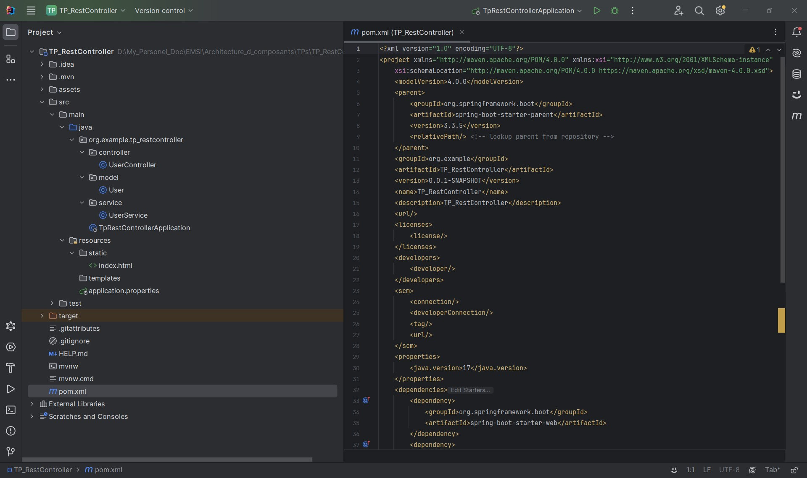
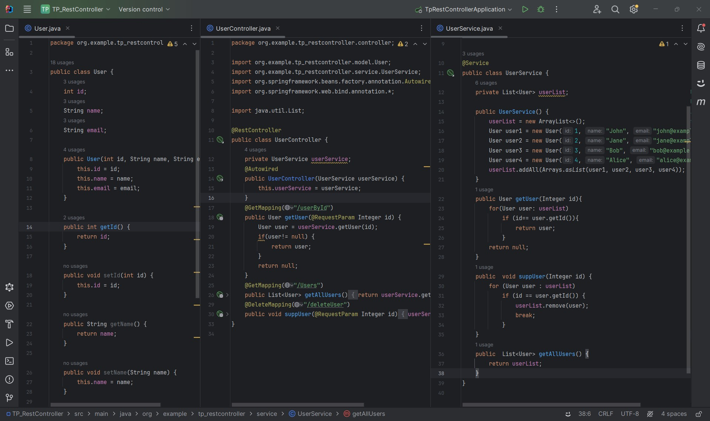
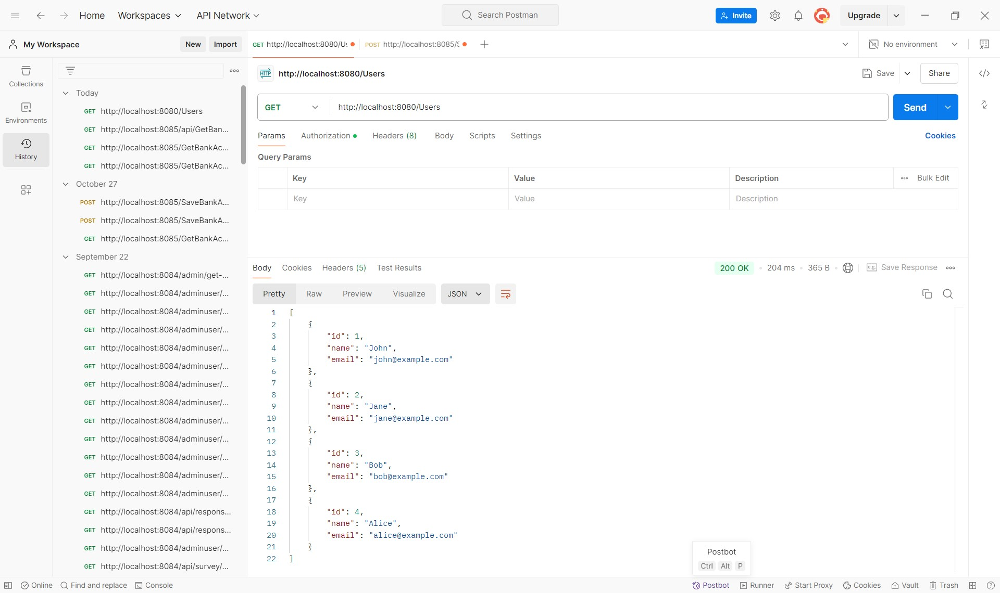
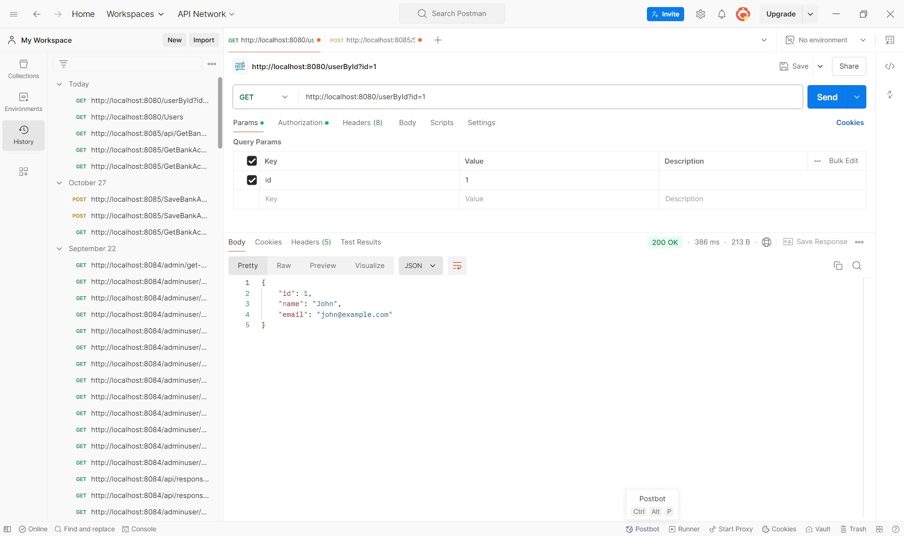

<h2>Compte rendu - TP RestController</h2>

<h3>1. Création d'un nouveau projet avec la dépendance Spring Web et les sous-répertoires «controller», «service» et «model» :</h3>

<h3>2. Ajout du modèle 'User', du service 'UserService' et du contrôleur 'UserController' :</h3>

<h3>3. Test :</h3>

